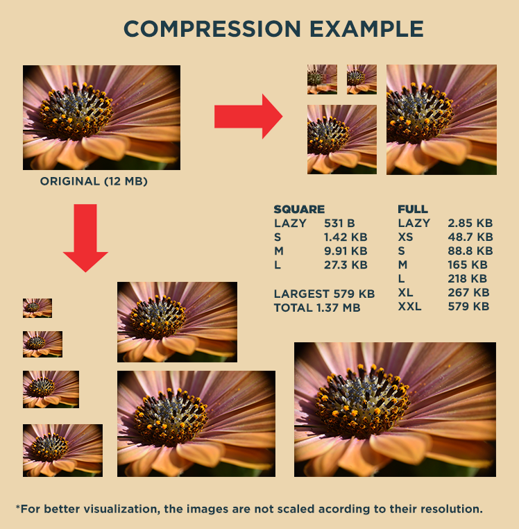
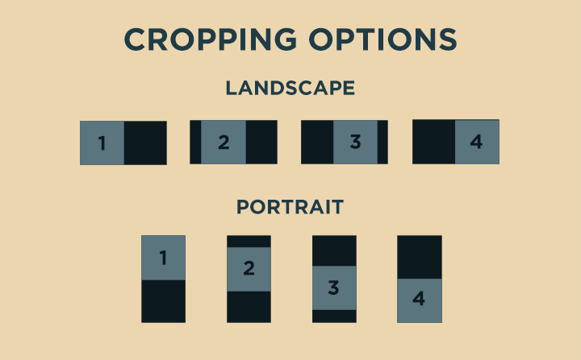

# python-image-compressor

> A script that compresses and makes diferent sizes of all images in child directories

## What is this about?

This script processes images. For each image, it creates several versions including thumbnails, lazy loading and diferent resolutions. It is intended to use for web or app applications, where all the images are on the server, and the user gets only the one that suits their resolution screen.

It navigates through children folders and compresses all images in them. Creates a new folder called `compressed` with all the new compressions in the same folder names of the original images.

## Versions for each image

### Square versions

- `SQ-S`: 50x50
- `SQ-M`: 200x200
- `SQ-L`: 400x400
- `LZ-SQ`: 50x50 lazy load image

### Full versions

The resolution for each version indicates the smaller side of the image (width for portrait and height for landscape). It is thought like that following the 720p, 1080p... notation.
The other dimension of the image is `smaller_side*aspect_ratio` and would depend on the original image itself.

- `FULL-XS`: 480p, ~SD
- `FULL-S`: 720p, ~HD
- `FULL-M`: 1080p, ~FullHD
- `FULL-L`: 1280p, ~WUXGA
- `FULL-XL`: 1440p, ~2k/QHD
- `FULL-XXL`: 2160p, ~4k/UHD
- `LZ-FULL`: 200p

## About the compression

The script uses a value of 80% for the normal images and a 10% for the lazy load images. The lazy load images are intended to be blurred when being displayed to the user. The compression value affects the actual JPG compression (where 100% would not make any compression at all).

Regular resizing algorightms may not match the pixels of the original image completely, that is, they might put 1081 pixel input image in a 1080 pixel output image. That causes an important loss of quality, because the pixels do not fit. This algorithm takes into account the aspect ratio, and if the pixels do not fit, it crops by 1 pixel the image, in order to not loose quality. A maximum row or column of 1 pixel can be cropped, because sometimes `min_size*aspect_ratio` may not be integer. Note that a single pixel crop is not visible to human sight and can be a better option in front of loosing quality.

### An example

The orginal images can be found at _images_ folder.

## How to run

Simply copy the script in the parent folder that has children folders with images to be compressed.

By default, it would make a central cropping for the square images. To crop any image differently, just add `-option-` to the source filename. Below are the options for cropping an horizontal or vertical image.

- `1`: slight left | top
- `2`: total left | higher
- `3`: slight right | lower
- `4`: total right | bottom

To apply this changes, rename the file to be compressed as <filename.jpg> -> <filename-option-.jpg>

Left crop example: DSC_1000.JPG -> DSC_1000-2-.JPG.

For a central cropping just leave the file name as it is.

## Authors

This repository is created and maintained by David Pujalte.
